# DeVolt

## Overview

DeVolt is revolutionizing the electric vehicle (EV) charging ecosystem by simplifying the process through energy tokenization. This enables users to effortlessly purchase energy from producers without the complexities of blockchain technology. The platform handles all transaction fees, ensuring a user-friendly and efficient experience while maintaining scalability with compressed accounts and tokens.
Harnessing the power of the **Solana blockchain**, our flagship product, the **DeVolt Payment Engine**, enables seamless energy transactions via the minting and burning of **VOLT tokens**. By incorporating the **Light Protocol** for **Zero-Knowledge (ZK) Compression**, DeVolt enhances privacy and scalability, setting new benchmarks in the decentralized energy marketplace.

Visit our website: [https://www.devolt.xyz/](https://www.devolt.xyz/)

## Resources

-   **Demo Video:** [https://www.devolt.xyz/demo](https://www.devolt.xyz/demo)
-   **Presentation:** [Link to presentation](https://drive.google.com/drive/folders/1auyDSagGdwYz28UgOmwnuwc0sAO1F9WP?usp=drive_link)
-   **Twitter Profile:** [https://x.com/ddevolt](https://x.com/ddevolt)

## Table of Contents

-   [Overview](#overview)
-   [Features](#features)
-   [Components](#components)
-   [Prerequisites](#prerequisites)
-   [Setup and Deployment](#setup-and-deployment)
    -   [1. Clone the Repository](#1-clone-the-repository)
    -   [2. Install Dependencies](#2-install-dependencies)
    -   [3. Configure Environment Variables](#3-configure-environment-variables)
    -   [4. Start the Local Solana Test Validator with Light Protocol](#4-start-the-local-solana-test-validator-with-light-protocol)
    -   [5. Deploy the Smart Contract](#5-deploy-the-smart-contract)
    -   [6. Run Backend Services](#6-run-backend-services)
    -   [7. Run the Mobile Application](#7-run-the-mobile-application)
-   [Testing](#testing)
-   [Environment Variables](#environment-variables)
-   [Resources](#resources)
-   [Logging and Monitoring](#logging-and-monitoring)
-   [Troubleshooting](#troubleshooting)
-   [Contact](#contact)
-   [Additional Notes](#additional-notes)

## Features

-   **Energy Transactions**: Facilitates the buying and selling of energy through a decentralized network.
-   **Token Management**: Handles the minting and burning of VOLT tokens to correspond with energy transactions.
-   **Secure Escrow**: Ensures secure transaction flows through an escrow mechanism, guaranteeing that tokens and funds are only exchanged when agreed-upon conditions are met.
-   **Zero-Knowledge (ZK) Compression**: Utilizes the Light Protocol to compress account data, enhancing privacy and scalability.
-   **Comprehensive Backend Services**: Robust APIs and services to manage business logic and interact seamlessly with blockchain components.
-   **User-Friendly Mobile Application**: Intuitive mobile interface for EV owners and energy producers to engage with the DeVolt network.

## Components

The DeVolt ecosystem is composed of several interconnected components, each responsible for specific functionalities:

-   **Anchor Program (`payment-engine`)**: Core smart contracts written in Rust, managing all blockchain interactions related to energy transactions and token management.
-   **API (`app/api`)**: Backend service built with Rust, interfacing with the blockchain and providing endpoints for frontend applications.
-   **Payment Energy Service (`app/payment-energy-service`)**: Handles business logic for energy transactions, including buying, selling, and confirming transactions, with integration of ZK Compression for enhanced privacy.
    -   **Light Protocol Integration**: Implements ZK Compression to ensure efficient and private transactions on the Solana blockchain, enhancing the platform's scalability and security.
-   **Mobile Application (`app/mobile`)**: A user-facing application enabling EV owners and energy producers to interact with the DeVolt network, manage their accounts, and execute transactions.

## Prerequisites

Before setting up the project, ensure you have the following installed on your machine:

-   **Node.js** (v20.9.0 or higher) and **Yarn**
-   **Rust Toolchain** (for Anchor and smart contract development)
-   **Solana CLI**: [Installation Guide](https://docs.solana.com/cli/install-solana-cli-tools)
-   **Anchor CLI v0.30.1**: [Installation Guide](https://www.anchor-lang.com/docs/installation)
-   **Light Protocol CLI**: [Installation Guide](https://docs.lightprotocol.com/)

## Setup and Deployment

Follow the steps below to set up and deploy the DeVolt platform locally.

### 1. Clone the Repository

```bash
git clone https://github.com/devolthq/devolt
cd devolt
```

### 2. Install Dependencies and Build the Program

Install the necessary dependencies for the entire project:

```bash
yarn install
anchor build
```

### 3. Configure Environment Variables

Create a `.env` file at the root of the project `./` and within the `./app/payment-energy-service/` directory. Ensure both `.env` files contain identical configurations.

**Example `.env` File:**

```env
DEVOLT_PAYMENT_ENGINE_ID="YOUR_PAYMENT_ENGINE_PROGRAM_ID"
USDC_MINT="YOUR_USDC_MINT_ADDRESS"
VOLT_MINT="YOUR_VOLT_MINT_ADDRESS"
DEVOLT_PROGRAM_PRIVATE_KEY="[YOUR_DEVOLT_PROGRAM_PRIVATE_KEY_ARRAY]"
DEVOLT_PRIVATE_KEY="[YOUR_DEVOLT_PRIVATE_KEY_ARRAY]"
JWT_SECRET="your_jwt_secret"
PAYMENT_ENGINE_SERVICE_URL="http://localhost:3000/json-rpc"
PRODUCER_KEYPAIR_BYTES="[YOUR_PRODUCER_KEYPAIR_ARRAY]"
CONSUMER_KEYPAIR_BYTES="[YOUR_CONSUMER_KEYPAIR_ARRAY]"
```

**Important:** Replace the placeholder values (e.g., `YOUR_PAYMENT_ENGINE_PROGRAM_ID`) with your actual keys and addresses. **Never** commit or expose your private keys in public repositories or shared documents.

### 4. Start the Local Solana Test Validator with Light Protocol

Open **Terminal 1** and start the Solana test validator integrated with the Light Protocol for ZK Compression.

```bash
light test-validator
```

**Expected Output:**

```
❯ light test-validator

⠙ Performing setup tasks...

Starting test validator... solana-test-validator
Executing command: solana-test-validator --reset --limit-ledger-size=10000 --rpc-port=8899 --gossip-host=127.0.0.1 --quiet --bpf-program noopb9bkMVfRPU8AsbpTUg8AQkHtKwMYZiFUjNRtMmV /path/to/spl_noop.so --bpf-program SySTEM1eSU2p4BGQfQpimFEWWSC1XDFeun3Nqzz3rT7 /path/to/light_system_program.so --bpf-program cTokenmWW8bLPjZEBAUgYy3zKxQZW6VKi7bqNFEVv3m /path/to/light_compressed_token.so --bpf-program compr6CUsB5m2jS4Y3831ztGSTnDpnKJTKS95d64XVq /path/to/account_compression.so --bpf-program Lighton6oQpVkeewmo2mcPTQQp7kYHr4fWpAgJyEmDX /path/to/light_registry.so --account-dir /path/to/accounts
8899 is up!
Server has passed stability checks.
Starting indexer...
8784 is up!
Indexer started successfully!
Kill existing prover process...
Starting prover...
3001 is up!
Prover started successfully!

Setup tasks completed successfully ✔
```

### 5. Deploy the Smart Contract

After the test validator is up and running, deploy the smart contract.

**In Terminal 1:**

```bash
./deploy-and-setup.sh
```

**`deploy-and-setup.sh` Script:**

```sh
#!/bin/bash

# Start the Solana test validator with Light Protocol
# light test-validator

# Set Solana CLI to use localnet
solana config set --url localhost

# Airdrop SOL to the default keypair
solana airdrop 2

echo "Creating tokens..."

echo "USDC Token"
spl-token create-token --decimals 6 --mint-authority admDPuh7ALjfpNr7pupdL7KE7ZCwW8iRuExWFrvZZkX

echo "VOLT Token"
spl-token create-token --decimals 6 --mint-authority admDPuh7ALjfpNr7pupdL7KE7ZCwW8iRuExWFrvZZkX

# Airdrop SOL to specific keypairs
solana airdrop 5 con9L1bjbUHHJiLLBbzBwWXmyerS54Hw5kEhvf4YkQS
solana airdrop 5 prozjgfrKQP59jGSXJkNKNSVFKCZNnS7FRqAt7dnvpA

# Deploy the Anchor program
# anchor deploy --provider.cluster localnet
```

**Note:** Ensure that `deploy-and-setup.sh` has execute permissions. If not, grant them using:

```bash
chmod +x deploy-and-setup.sh
```

**Expected Output:**

```
❯ ./deploy-and-setup.sh

Config File: /Users/username/.config/solana/cli/config.yml
RPC URL: http://localhost:8899
WebSocket URL: ws://localhost:8900/ (computed)
Keypair Path: /Users/username/.config/solana/id.json
Commitment: confirmed
Requesting airdrop of 2 SOL

Signature: <airdrop-signature>

500000102 SOL
Creating tokens...
USDC Token
Creating token BfzUKECaoe7rGYhApPeZmrqd8wnk6tGv8EFaCrVrEVSL under program TokenkegQfeZyiNwAJbNbGKPFXCWuBvf9Ss623VQ5DA

Address:  BfzUKECaoe7rGYhApPeZmrqd8wnk6tGv8EFaCrVrEVSL
Decimals:  6

Signature: <USDC-mint-signature>

VOLT Token
Creating token 8VLMV4CkuDCistCFkW9VkLwbJhWJTSz2CQxrYu3ZrF5t under program TokenkegQfeZyiNwAJbNbGKPFXCWuBvf9Ss623VQ5DA

Address:  8VLMV4CkuDCistCFkW9VkLwbJhWJTSz2CQxrYu3ZrF5t
Decimals:  6

Signature: <VOLT-mint-signature>

Requesting airdrop of 5 SOL

Signature: <airdrop-signature>

5 SOL
Requesting airdrop of 5 SOL

Signature: <airdrop-signature>

5 SOL
```

### 6. Run Backend Services

The backend consists of the API and the Payment Energy Service. These services handle interactions with the blockchain and manage business logic.

**Terminal 2: Run the API Backend**

```bash
cd app/api/
cargo run
```

**Terminal 3: Run the Payment Energy Service**

```bash
cd app/payment-energy-service/
yarn
yarn start
```

### 7. Run the Mobile Application

The mobile application allows EV owners and energy producers to interact with the DeVolt network.

**Terminal 4: Run the Mobile App**

```bash
cd app/mobile/
yarn
yarn start -c
```

## Testing

To run tests for the payment engine, execute the following command:

```bash
anchor test
```

Ensure that the test validator is running before executing the tests.

## Environment Variables

Ensure you have a `.env` file at the root of your project and within the `./app/payment-energy-service/` directory with the following variables:

```env
DEVOLT_PAYMENT_ENGINE_ID="YOUR_PAYMENT_ENGINE_PROGRAM_ID"
DEVOLT_PROGRAM_PRIVATE_KEY="[YOUR_DEVOLT_PROGRAM_PRIVATE_KEY_ARRAY]"
DEVOLT_PRIVATE_KEY="[YOUR_DEVOLT_PRIVATE_KEY_ARRAY]"
USDC_MINT="YOUR_USDC_MINT_ADDRESS"
VOLT_MINT="YOUR_VOLT_MINT_ADDRESS"
JWT_SECRET="your_jwt_secret"
PAYMENT_ENGINE_SERVICE_URL="http://localhost:3000/json-rpc"
PRODUCER_KEYPAIR_BYTES="[YOUR_PRODUCER_KEYPAIR_ARRAY]"
CONSUMER_KEYPAIR_BYTES="[YOUR_CONSUMER_KEYPAIR_ARRAY]"
```

**Example `.env` File:**

```env
DEVOLT_PAYMENT_ENGINE_ID="ESuw654Qfojyf1U14TATKTBtTc23vkdyREcD2FNuHJXT"
USDC_MINT="BfzUKECaoe7rGYhApPeZmrqd8wnk6tGv8EFaCrVrEVSL"
VOLT_MINT="8VLMV4CkuDCistCFkW9VkLwbJhWJTSz2CQxrYu3ZrF5t"
DEVOLT_PROGRAM_PRIVATE_KEY="[169,114,18,80,209,241,60,67,37,246,238,86,228,23,67,134,120,207,171,73,39,140,35,65,85,96,240,241,38,63,109,18,9,117,215,33,104,135,92,31,24,58,24,112,17,87,118,30,246,238,238,241,83,80,81,210,51,243,62,129,202,65,224,109]"
DEVOLT_PRIVATE_KEY="[94,81,92,183,2,61,203,40,162,234,112,4,209,215,124,100,144,123,232,25,70,73,154,130,124,210,10,175,62,230,27,175,8,157,187,229,126,241,43,126,216,162,105,235,250,183,161,236,244,144,89,116,3,247,67,200,82,93,63,104,70,143,124,76]"
JWT_SECRET="your_jwt_secret"
PAYMENT_ENGINE_SERVICE_URL="http://localhost:3000/json-rpc"
PRODUCER_KEYPAIR_BYTES="[239, 244, 218, 57, 218, 179, 145, 208, 32, 225, 107,208, 180, 142, 142, 181, 121,154, 217, 67, 212, 74, 19, 23, 115, 16, 254, 206, 40,85, 201, 78, 12, 66, 158, 97,110, 253, 230, 194, 145, 180, 124, 92, 250, 137, 222, 58, 192, 93, 56, 208, 134,34, 192, 85, 113, 32, 168, 50, 209, 111, 105, 107]"
CONSUMER_KEYPAIR_BYTES="[121, 225, 52, 151, 9, 51, 15, 189, 164, 202, 191, 246, 15, 218, 89, 28, 208, 161,240, 200, 2, 231, 81, 66, 218, 90, 141, 222, 95, 25, 9,144, 9, 44, 56, 131, 62,16, 193, 9, 61, 110, 143, 41, 117, 75, 164, 61, 187, 83,242, 209, 132, 204, 39,163, 220, 40, 111, 20, 126, 79, 28, 99]"
```

**Important:** Replace the placeholder values (e.g., `YOUR_PAYMENT_ENGINE_PROGRAM_ID`) with your actual keys and addresses. **Never** commit or expose your private keys in public repositories or shared documents.

## Logging and Monitoring

The application provides detailed logging for each step of the process. Logs include:

-   **Connection Status:** Confirms connection to the Solana test validator.
-   **Account Initialization:** Details about token accounts creation and retrieval.
-   **Transaction Details:** Information about transaction IDs and their statuses.
-   **Error Logs:** Detailed error messages and transaction details for debugging.

Ensure you monitor the terminal outputs for any issues during deployment and operation.

## Troubleshooting

If you encounter issues during setup or operation, consider the following steps:

1. **Ensure Dependencies are Installed Correctly:**

    - Verify that Node.js, Yarn, Rust, Solana CLI, Anchor CLI, and Light Protocol CLI are properly installed.

2. **Check Environment Variables:**

    - Ensure that the `.env` files contain correct and valid values.

3. **Validate Solana/Light Test Validator:**

    - Ensure that the test validator is running and accessible at `http://127.0.0.1:8899`.

4. **Verify Program Deployment:**

    - Confirm that the smart contract is deployed successfully and the program ID matches the one in the `.env` file.

5. **Review Logs for Errors:**

    - Examine terminal logs for specific error messages and follow the guidance provided in the logs.

6. **Light Protocol Issues:**

    - If ZK Compression-related errors occur, ensure that the Light Protocol services are running correctly and that the necessary BPF programs are loaded.

7. **Airdrop SOL:**
    - Ensure sufficient SOL balance in your keypairs by requesting additional airdrops if necessary.

## Contact

For any inquiries or further information, please contact:

-   **Marcelo Feitoza**
    -   Email: [marcelo.feitoza@sou.inteli.edu.br](mailto:marcelo.feitoza@sou.inteli.edu.br)
-   **Matheus Santos**
    -   Email: [matheus.santos@sou.inteli.edu.br](mailto:matheus.santos@sou.inteli.edu.br)

## Additional Notes

In our DeVolt project, we utilize compressed tokens and compressed accounts through our integration with the Light Protocol. Specifically, within the payment energy service API, we implement account abstraction, which allows users to interact with our platform without needing to manage blockchain interactions directly. This means that all fees associated with buying and selling energy transactions, as well as the confirmation of these transactions, are handled by us. By using compressed accounts and tokens, we are able to significantly minimize the costs related to user fees, enabling our platform to scale efficiently without incurring high maintenance expenses. The integration with Zero-Knowledge (ZK) Compression is implemented in the `app/payment-energy-service/` directory of our repository, ensuring that our system remains both cost-effective and scalable.

### Light Protocol Integration

The integration of the Light Protocol for ZK Compression enhances the scalability and privacy of transactions. Ensure that the Light Protocol services are correctly configured and running alongside your Solana test validator.

### Token Accounts Caching

The application caches token account addresses to optimize performance. If you encounter issues with token accounts, consider clearing the cache or verifying the cached addresses. This applies to token accounts for USDC, VOLT, which are always the same for the same user.

### Security

Always keep your private keys secure. Never expose your private keys in public repositories or logs.

### Screenshots

Here are some screenshots of the DeVolt mobile application to give you a better understanding of the user interface and experience:

**Onboarding Process**

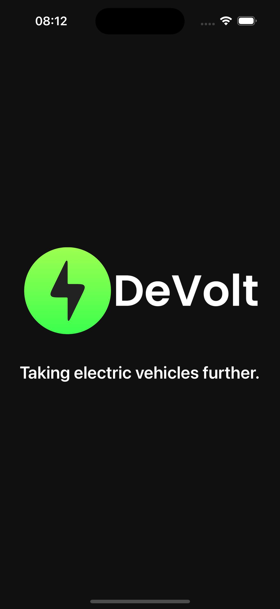
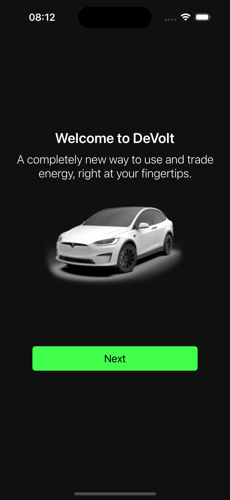
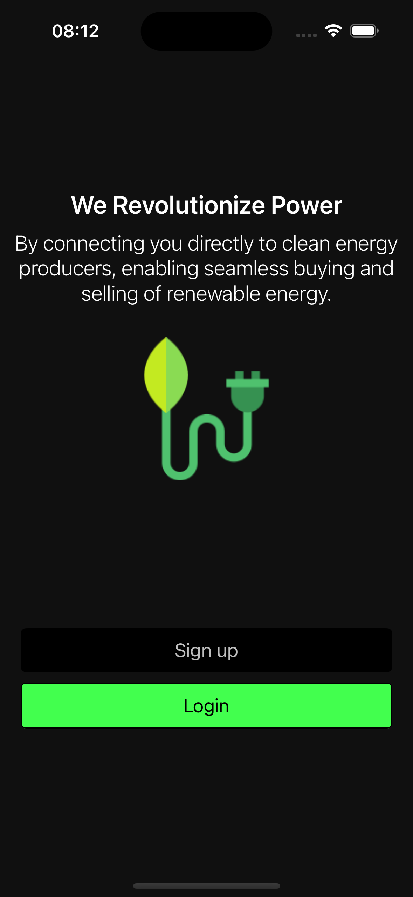

**Login Screen**

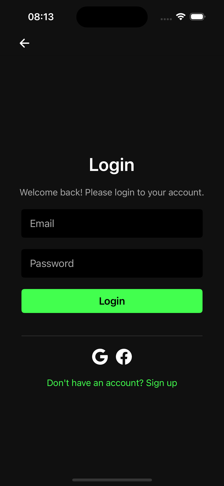

**Home Screens**

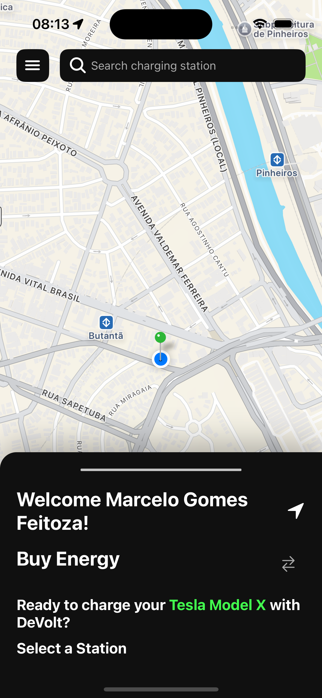
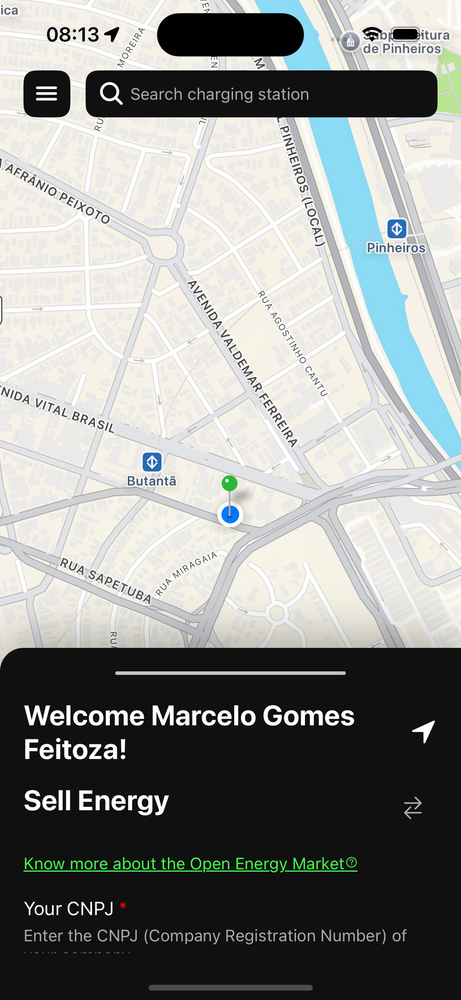
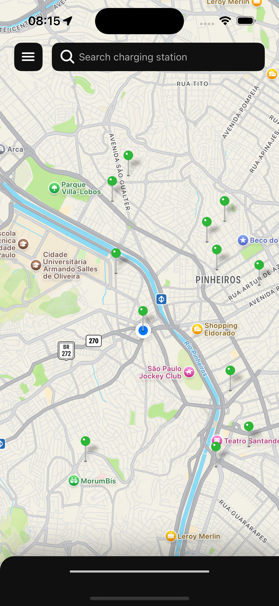

**Buying Energy**

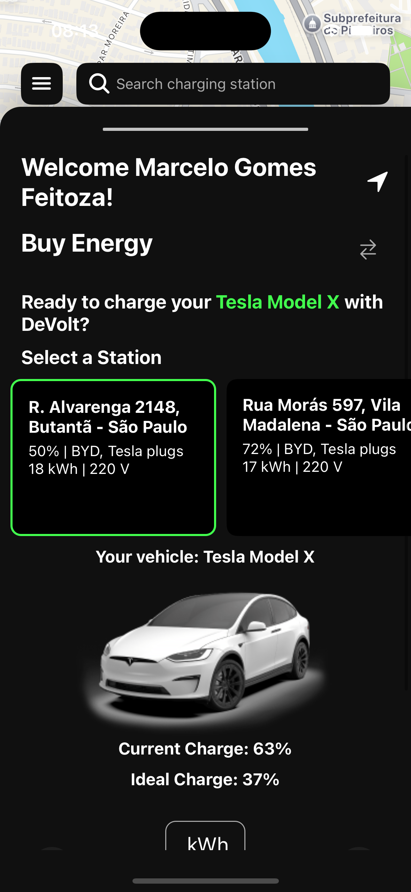
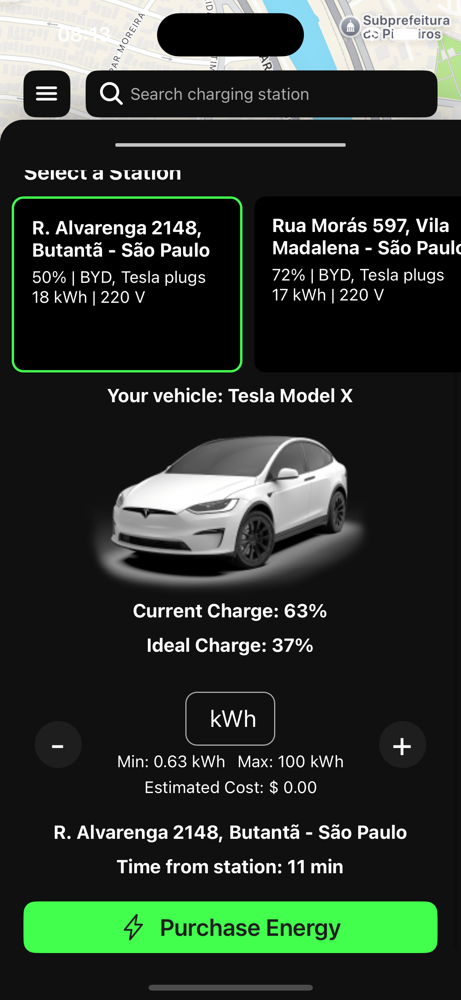

**Selling Energy**

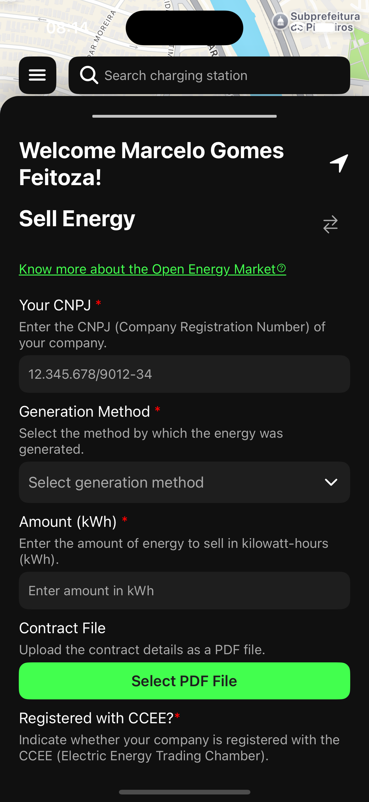
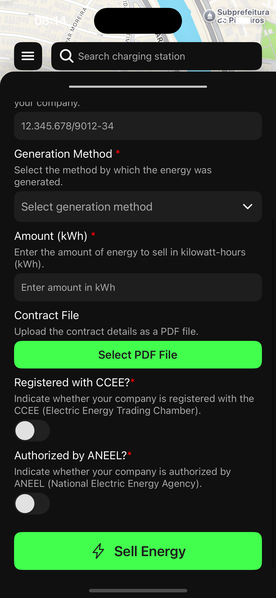

**User Profile**

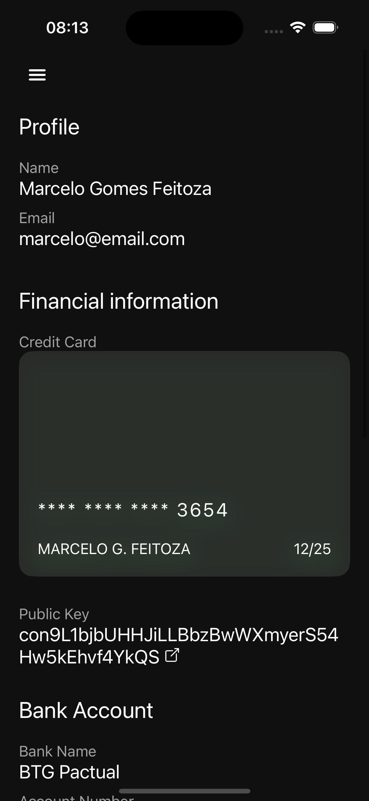

---

**Happy Charging! ⚡🚗**
